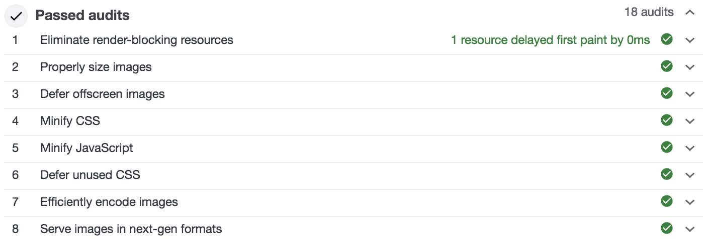

# WordPress Accelerator 

This Fly App speeds up any WordPress site by optimizing images and reducing render-blocking resources, which dramatically improves Lighthouse scores.

## Lighthouse

Google Lighthouse measures user perceived application performance, and assigns a score of 0-100 (100 is good, 0 is gross).

### Before optimizations

### With optimizations

## What it does

This app primarily optimizes images and reduces render-blocking resources:

1. Converts ALL images to webp for browsers that support it
2. Lazy-loads offscreen and hidden images (image tags AND background images)
3. Sets `srcset` attributes on image tags for proper image sizing
4. Sets `defer` attributes on `<script>` tags
5. Stores assets in Fly's global cache, speeding your app up all over the world 

## Try it yourself

1. First, make sure you have the latest version of Fly installed by running `npm i -g @fly/fly`
2. `git clone https://github.com/superfly/wordpress-image-optimizer.git`
3. `cd wordpress-image-optimizer`
4. `fly server`
5. Visit http://localhost:3000 to view the app

You should see an example WordPress site (https://www.thewaltdisneycompany.com/)

6. Navigate to the `index.js` file and change `const origin` (line#6), `const assets` (line#7), and `const rewrites` (line#34) to appropriately match your own domain
7. If your site contains background images, add their selectors to `const bgImages` (line#25) AND `const images` (line#28) in `image-observer.js`
8. Lines #167-173 focuses on reducing render-blocking resources. You may need to modify this section to match your own render-blocking resources (if any)
9. Save and visit localhost again

You should now see your own WordPress site with properly sized, lazy-loading, WebP images with no render-blocking resources! Run a Lighthouse audit and see for yourself just how well your site is performing .. and then, deploy!

10. Run `fly login` (make sure you have a Fly account first, if you don’t, register at https://fly.io/app/sign-up)
11. Run `fly apps create <app-name>` to create a Fly Edge App
12. Then run `fly deploy` to deploy your Fly Edge App